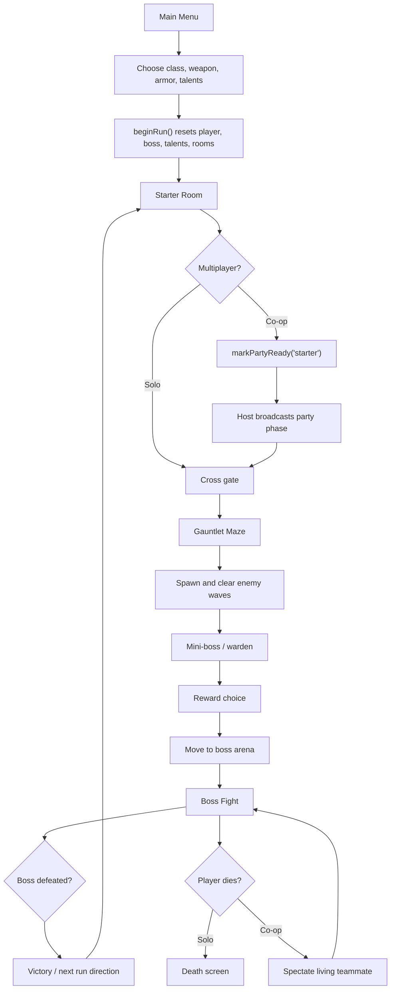
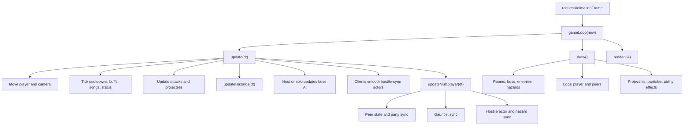
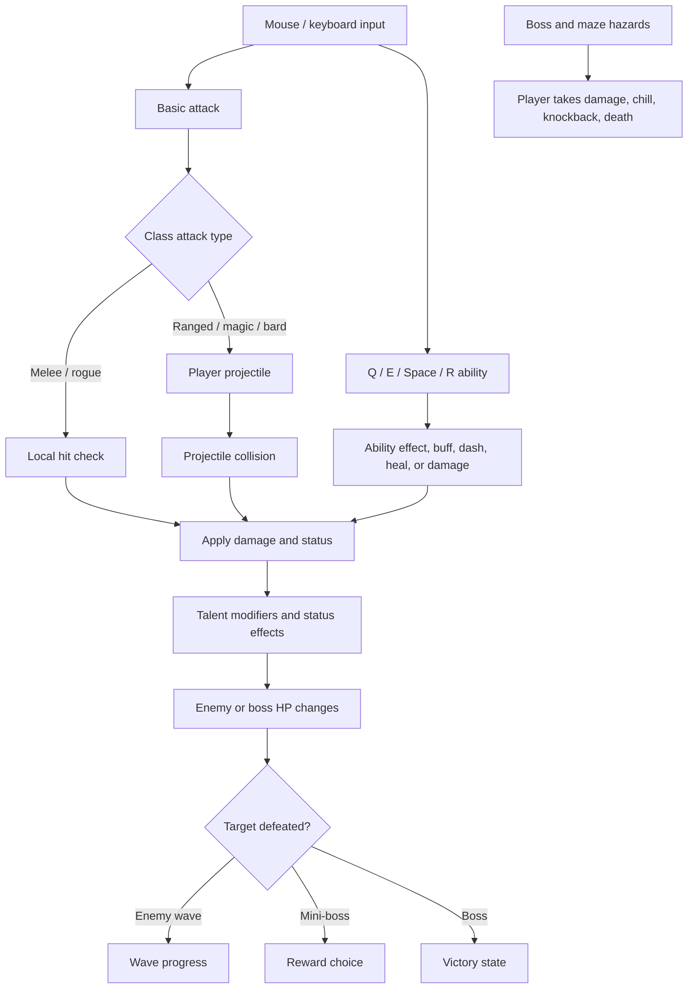
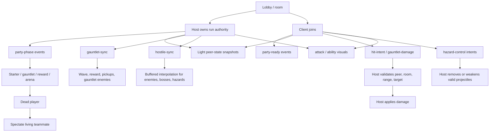

# Game Flow And Future Direction Map

This document maps how the game currently functions and where it can grow next. It is meant to be practical: a readable reference for design decisions, debugging, and future Codex handoffs.

Companion implementation map: `ROADMAP_IMPLEMENTATION.md`.

## Current Game Loop

Notes:
- The run starts through `beginRun()`, then moves between starter, maze, reward, and arena phases.
- In multiplayer, host-driven party phases keep both players aligned before entering gauntlet or arena content.
- The current core loop is already roguelite-shaped: fight, earn a reward, progress to a harder boss phase or next encounter.

## Update And Render Loop

Notes:
- The host or solo player owns boss AI and hostile simulation.
- Non-host clients render host-owned enemies and hazards through smoothing rather than full authority.
- Debug report and HUD hooks are important because multiplayer bugs often show up as timing or stale-sync issues.

## Combat Flow

Notes:
- Classes are mostly expressed through weapon tags, ability loadouts, projectiles, effects, and talents.
- Boss and maze hazards are the main threat language: telegraphs, projectiles, puddles, lines, rings, slams, and moving obstacles.
- Current pain points to keep improving are projectile readability, repeated hit prevention, and boss-specific hazard polish.

## Multiplayer Flow

Notes:
- The host is authoritative for shared enemies, boss HP, hostile hazards, wave progression, and party phase.
- Clients send intent, not final truth, for enemy damage and hazard cleanup.
- `hostile-sync` is the key smoothing path for enemies, boss bodies, boss sub-objects, and moving hazards.
- Remaining multiplayer priorities are reducing stale packets, making boss hazards consistent, and keeping client feedback immediate.

## Current Systems At A Glance

| System | Current role | What matters most |
| --- | --- | --- |
| Classes | Weapon tags, ability loadouts, talents, projectiles, visuals | Strong identity and clear combat role |
| Talents | Run-time build modifiers | Fewer dead choices, better class-specific synergies |
| Gauntlet | Pre-boss survival and reward phase | Enemy pathing, reward pacing, multiplayer sync |
| Mini-boss rewards | Power spikes between encounters | Delayed selection, good choices, no accidental clicks |
| Bosses | Main content and mechanical variety | Telegraph clarity, fair hazards, phase identity |
| Multiplayer | Shared run with host authority | Smooth enemies, stable phase sync, fair damage |
| Spectate | Keeps dead co-op players involved | Clear camera, readable teammate state |
| Debug reports | Fast issue capture | Include phase, sync age, host/client role, recent events |

## Future Directions

```mermaid
flowchart TD
  Game["Current Boss Fight Game"] --> Stability["Stability and feel"]
  Game --> Content["More content"]
  Game --> Progression["Longer-term progression"]
  Game --> Tools["Development tools"]

  Stability --> Netcode["Smoother multiplayer and fewer ghost hits"]
  Stability --> Readability["Cleaner boss telegraphs and hit feedback"]
  Stability --> UX["Reward, death, spectate, and lobby polish"]

  Content --> Classes["More class identity and talents"]
  Content --> Bosses["More bosses, phases, and mini-bosses"]
  Content --> Gauntlets["More room layouts, hazards, and enemy types"]

  Progression --> Unlocks["Unlockable classes, bosses, skins, relics"]
  Progression --> Meta["Meta upgrades or challenge tiers"]
  Progression --> Endgame["Boss rush, endless gauntlet, daily run"]

  Tools --> Balancing["Balance tables and tuning presets"]
  Tools --> Debug["Better sync and combat debug overlays"]
  Tools --> ContentPipeline["Faster way to add bosses, hazards, rewards"]
```

### Roadmap Ideas

| Timing | Direction | Why it helps |
| --- | --- | --- |
| Now | Stabilize multiplayer sync, projectile cleanup, and boss hazard consistency | Makes every future feature feel better and reduces frustrating co-op bugs |
| Now | Improve boss readability with clearer telegraphs and less visual clutter | Makes deaths feel fair and helps players learn patterns |
| Now | Polish reward UX and mini-boss choice timing | Prevents accidental choices and makes gauntlets feel rewarding |
| Next | Deepen class identity for Bard, Paladin, Rogue, Mage, Ranger, and Melee | Gives players reasons to replay and compare builds |
| Next | Add more gauntlet room variation and enemy behavior | Keeps the path to each boss from feeling repetitive |
| Next | Balance talents around build branches and capstone moments | Makes each run feel like it has a direction |
| Later | Add meta progression, unlocks, and challenge tiers | Gives the game a longer tail beyond single runs |
| Later | Add boss rush, endless gauntlet, or daily run modes | Creates replayable goals without needing a full campaign first |
| Later | Build internal content tools for hazards, rewards, and boss patterns | Speeds up future content and keeps tuning safer |

## Recommended Next Moves

1. Keep multiplayer stability as the near-term priority.
2. Use debug reports to target the worst boss-specific hazards one at a time.
3. Give each class one clear support, damage, survival, or mobility identity.
4. Treat gauntlet rewards as the main run-shaping system.
5. Add content only after the sync and readability foundations feel solid.
