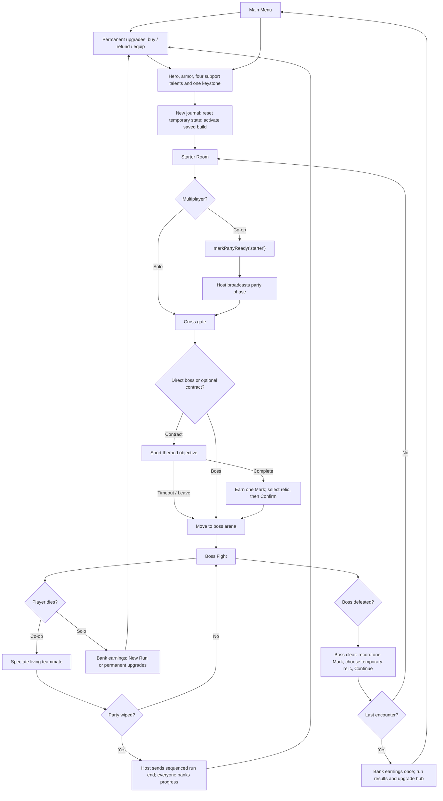
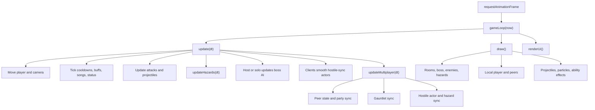
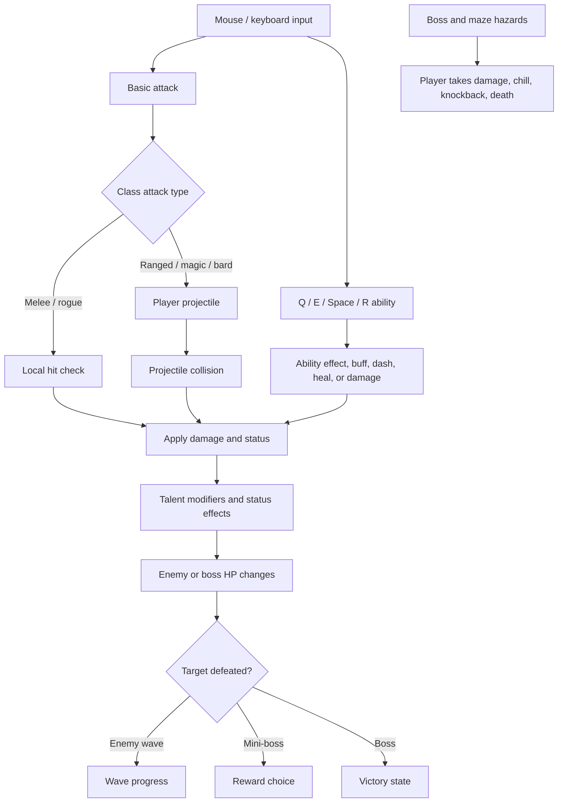
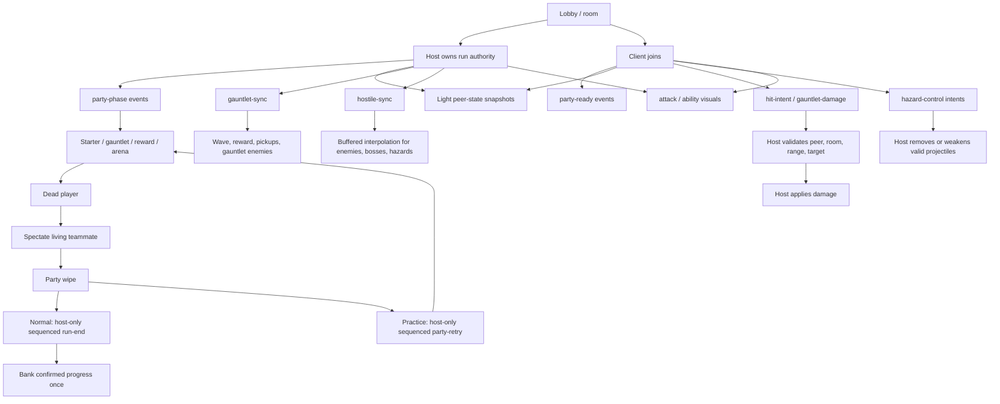

# Game Flow And Future Direction Map

This document maps how the game currently functions and where it can grow next. It is meant to be practical: a readable reference for design decisions, debugging, and future Codex handoffs.

Companion implementation map: `ROADMAP_IMPLEMENTATION.md`.

## Current Game Loop

```mermaid
flowchart TD
  Menu["Main Menu"] --> Hub["Permanent upgrades: buy / refund / equip"]
  Hub --> Build["Hero, armor, four support talents and one keystone"]
  Menu --> Build
  Build --> RunStart["New journal; reset temporary state; activate saved build"]
  RunStart --> Starter["Starter Room"]
  Starter --> Ready{"Multiplayer?"}
  Ready -->|Solo| Gate["Cross gate"]
  Ready -->|Co-op| PartyReady["markPartyReady('starter')"]
  PartyReady --> PhaseGate["Host broadcasts party phase"]
  PhaseGate --> Gate
  Gate --> Route{"Direct boss or optional contract?"}
  Route -->|Contract| Gauntlet["Short themed objective"]
  Gauntlet -->|Complete| Reward["Earn one Mark; select relic, then Confirm"]
  Gauntlet -->|Timeout / Leave| ArenaReady
  Route -->|Boss| ArenaReady
  Reward --> ArenaReady["Move to boss arena"]
  ArenaReady --> BossFight["Boss Fight"]
  BossFight --> Win{"Boss defeated?"}
  BossFight --> Death{"Player dies?"}
  Win --> Intermission["Boss clear: record one Mark, choose temporary relic, Continue"]
  Intermission --> Final{"Last encounter?"}
  Final -->|No| Starter
  Final -->|Yes| Victory["Bank earnings once; run results and upgrade hub"]
  Death -->|Solo| GameOver["Bank earnings; New Run or permanent upgrades"]
  Death -->|Co-op| Spectate["Spectate living teammate"]
  Spectate --> Wipe{"Party wiped?"}
  Wipe -->|No| BossFight
  Wipe -->|Yes| PartyEnd["Host sends sequenced run end; everyone banks progress"]
  PartyEnd --> Hub
  GameOver --> Hub
  Victory --> Menu
```

Notes:
- The run starts through `beginRun()`, then moves between starter, maze, reward, and arena phases.
- Normal death or party wipe ends the run. Practice awards no Marks and permits full-health encounter checkpoint retries.
- Solo menus pause simulation. Co-op menus keep simulation and networking running; a shared input gate prevents menu actions from attacking.
- A complete run contains eleven encounters. Each has a direct boss path and an optional objective contract; the Trio and Sauce remain separate encounters.
- In multiplayer, host-driven party phases keep both players aligned before entering gauntlet or arena content.
- Permanent purchases happen after settlement. Temporary relics shape the current run; unlocked class builds shape subsequent attempts. A versioned journal prevents duplicated earnings and offers solo recovery after reload.

## Update And Render Loop

```mermaid
flowchart TD
  Frame["requestAnimationFrame"] --> GameLoop["gameLoop(now)"]
  GameLoop --> Update["update(dt)"]
  Update --> Movement["Move player and camera"]
  Update --> Timers["Tick cooldowns, buffs, songs, status"]
  Update --> Combat["Update attacks and projectiles"]
  Update --> Hazards["updateHazards(dt)"]
  Update --> BossAI["Host or solo updates boss AI"]
  Update --> RemoteHostiles["Clients smooth hostile-sync actors"]
  Update --> Multiplayer["updateMultiplayer(dt)"]
  Multiplayer --> StateSync["Peer state and party sync"]
  Multiplayer --> GauntletSync["Gauntlet sync"]
  Multiplayer --> HostileSync["Hostile actor and hazard sync"]
  GameLoop --> Draw["draw()"]
  Draw --> World["Rooms, boss, enemies, hazards"]
  Draw --> Players["Local player and peers"]
  Draw --> Effects["Projectiles, particles, ability effects"]
  GameLoop --> UI["renderUi()"]
```

Notes:
- The host or solo player owns boss AI and hostile simulation.
- Non-host clients render host-owned enemies and hazards through smoothing rather than full authority.
- Debug report and HUD hooks are important because multiplayer bugs often show up as timing or stale-sync issues.

## Combat Flow

```mermaid
flowchart TD
  Input["Mouse / keyboard input"] --> Basic["Basic attack"]
  Input --> Ability["Q / E / Space / R ability"]
  Basic --> ProjectileOrMelee{"Class attack type"}
  ProjectileOrMelee -->|Melee / rogue| DirectHit["Local hit check"]
  ProjectileOrMelee -->|Ranged / magic / bard| Projectile["Player projectile"]
  Ability --> AbilityEffect["Ability effect, buff, dash, heal, or damage"]
  Projectile --> Collision["Projectile collision"]
  DirectHit --> Damage["Apply damage and status"]
  AbilityEffect --> Damage
  Collision --> Damage
  Damage --> Talents["Talent modifiers and status effects"]
  Talents --> TargetState["Enemy or boss HP changes"]
  TargetState --> DeathCheck{"Target defeated?"}
  DeathCheck -->|Enemy wave| WaveProgress["Wave progress"]
  DeathCheck -->|Mini-boss| Reward["Reward choice"]
  DeathCheck -->|Boss| Victory["Victory state"]
  Hazards["Boss and maze hazards"] --> PlayerHit["Player takes damage, chill, knockback, death"]
```

Notes:
- Classes are mostly expressed through weapon tags, ability loadouts, projectiles, effects, and talents.
- Boss and maze hazards are the main threat language: telegraphs, projectiles, puddles, lines, rings, slams, and moving obstacles.
- Current pain points to keep improving are projectile readability, repeated hit prevention, and boss-specific hazard polish.

## Multiplayer Flow

```mermaid
flowchart TD
  Lobby["Lobby / room"] --> Host["Host owns run authority"]
  Lobby --> Client["Client joins"]
  Host --> PartyPhase["party-phase events"]
  Client --> Ready["party-ready events"]
  PartyPhase --> SharedPhase["Starter / gauntlet / reward / arena"]
  Host --> PeerState["Light peer-state snapshots"]
  Client --> PeerState
  Host --> Gauntlet["gauntlet-sync"]
  Gauntlet --> MazeTruth["Wave, reward, pickups, gauntlet enemies"]
  Host --> Hostile["hostile-sync"]
  Hostile --> SmoothEnemies["Buffered interpolation for enemies, bosses, hazards"]
  Client --> HitIntent["hit-intent / gauntlet-damage"]
  HitIntent --> HostValidate["Host validates peer, room, range, target"]
  HostValidate --> ApplyDamage["Host applies damage"]
  Client --> HazardControl["hazard-control intents"]
  HazardControl --> HostHazards["Host removes or weakens valid projectiles"]
  Client --> Visuals["attack / ability visuals"]
  Host --> Visuals
  SharedPhase --> Death["Dead player"]
  Death --> Spectate["Spectate living teammate"]
  Spectate --> Wipe["Party wipe"]
  Wipe --> End["Normal: host-only sequenced run-end"]
  End --> Settlement["Bank confirmed progress once"]
  Wipe --> Retry["Practice: host-only sequenced party-retry"]
  Retry --> SharedPhase
```

Notes:
- The host is authoritative for shared enemies, boss HP, hostile hazards, wave progression, and party phase.
- Clients send intent, not final truth, for enemy damage and hazard cleanup.
- `hostile-sync` is the key smoothing path for enemies, boss bodies, boss sub-objects, and moving hazards.
- Practice retry events are validated against the server's room mode, host identity, party wipe, encounter kind/room, and increasing sequence. Normal runs reject retries. Run-end messages are host-only and sequenced; progression is device-local and settles once.
- Host departure ends the active run and returns the remaining party to lobby state with an explanation.

## Current Systems At A Glance

| System | Current role | What matters most |
| --- | --- | --- |
| Classes | Weapon tags, ability loadouts, talents, projectiles, visuals | Strong identity and clear combat role |
| Talents | Permanent ownership; four support slots and one keystone | Meaningful interactions and class-specific synergies |
| Contracts | Optional themed objectives; temporary relic and Mark | More authored routes, enemy composition and fair risk/reward |
| Mini-boss rewards | Power spikes between encounters | Delayed selection, good choices, no accidental clicks |
| Bosses | Main content and mechanical variety | Telegraph clarity, fair hazards, phase identity |
| Multiplayer | Shared run with host authority | Smooth enemies, stable phase sync, fair damage |
| Spectate | Keeps dead co-op players involved | Clear camera, readable teammate state |
| Debug reports | Fast issue capture | Include phase, sync age, host/client role, recent events |

## Future Directions

```mermaid
flowchart TD
  Game["Current Boss Fight Game"] --> Stability["Stability and feel"]
  Game --> Content["More content"]
  Game --> Progression["Longer-term progression"]
  Game --> Tools["Development tools"]

  Stability --> Netcode["Smoother multiplayer and fewer ghost hits"]
  Stability --> Readability["Cleaner boss telegraphs and hit feedback"]
  Stability --> UX["Reward, death, spectate, and lobby polish"]

  Content --> Classes["More class identity and talents"]
  Content --> Bosses["More bosses, phases, and mini-bosses"]
  Content --> Gauntlets["More room layouts, hazards, and enemy types"]

  Progression --> Unlocks["Unlockable classes, bosses, skins, relics"]
  Progression --> Meta["Meta upgrades or challenge tiers"]
  Progression --> Endgame["Boss rush, endless gauntlet, daily run"]

  Tools --> Balancing["Balance tables and tuning presets"]
  Tools --> Debug["Better sync and combat debug overlays"]
  Tools --> ContentPipeline["Faster way to add bosses, hazards, rewards"]
```

### Roadmap Ideas

| Timing | Direction | Why it helps |
| --- | --- | --- |
| Now | Stabilize multiplayer sync, projectile cleanup, and boss hazard consistency | Makes every future feature feel better and reduces frustrating co-op bugs |
| Now | Improve boss readability with clearer telegraphs and less visual clutter | Makes deaths feel fair and helps players learn patterns |
| Now | Polish reward UX and mini-boss choice timing | Prevents accidental choices and makes gauntlets feel rewarding |
| Next | Deepen class identity for Bard, Paladin, Rogue, Mage, Ranger, and Melee | Gives players reasons to replay and compare builds |
| Next | Add more gauntlet room variation and enemy behavior | Keeps the path to each boss from feeling repetitive |
| Next | Balance talents around build branches and capstone moments | Makes each run feel like it has a direction |
| Later | Add meta progression, unlocks, and challenge tiers | Gives the game a longer tail beyond single runs |
| Later | Add boss rush, endless gauntlet, or daily run modes | Creates replayable goals without needing a full campaign first |
| Later | Build internal content tools for hazards, rewards, and boss patterns | Speeds up future content and keeps tuning safer |

## Recommended Next Moves

1. Keep multiplayer stability as the near-term priority.
2. Use debug reports to target the worst boss-specific hazards one at a time.
3. Give each class one clear support, damage, survival, or mobility identity.
4. Treat gauntlet rewards as the main run-shaping system.
5. Add content only after the sync and readability foundations feel solid.
