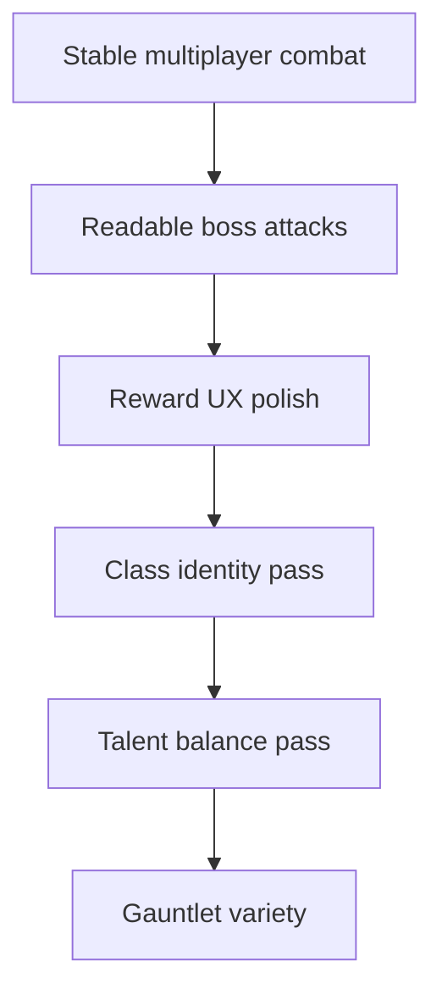
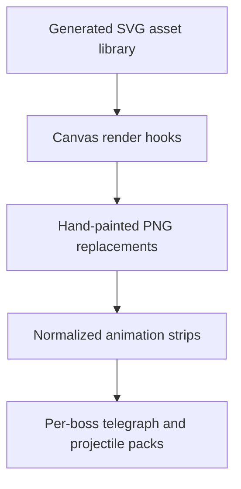

# Roadmap Implementation Plan

This is the build map for turning the game flow roadmap into shippable work. The current pass focuses on a working foundation: generated art assets, runtime loading, and first render hookups that can be improved without changing gameplay code.

## Working Now

| Area | Implemented |
| --- | --- |
| Art pipeline | `scripts/generate-game-art.js` creates a deterministic SVG asset library. |
| Classes | Six 4x4 class spritemaps exist under `assets/generated/classes`. Missing class PNGs can fall back to these sheets. |
| Bosses | Thirteen 4x4 boss/condiment spritemaps exist under `assets/generated/bosses`. Core arena bosses and condiments can draw from them. |
| Projectiles | Player and hostile projectile images exist under `assets/generated/projectiles` and are used by the canvas renderer. |
| UI | Buttons, reward cards, ability icons, potion icon, and class stand icons use generated image assets. |
| Flow doc | `GAME_FLOW.md` maps the current loop, combat, multiplayer, and future directions. |

## Short-Term Build Path

Short-term work should keep the current architecture and improve the feel:

- Finish multiplayer cleanup around hostile sync, projectile ownership, and reward selection.
- Add stronger telegraph images for boss hazards and use them consistently.
- Tune Bard, Paladin, Rogue, Mage, Ranger, and Warrior so each has a clear role.
- Make reward popups, talent choices, and class selection feel deliberate and hard to misclick.

## Asset Upgrade Path

The generated SVGs are intentionally stable placeholders. They give every system an image-backed asset now, while keeping room for richer PNG sprite sheets later.

Recommended asset replacement order:

1. Boss projectiles and hazards, because readability affects fairness.
2. Boss body animation sheets, because they define the fight personality.
3. Class attack and ability effects, because they sell class identity.
4. UI buttons, icons, reward cards, and menus, because polish matters more once combat is readable.

## Feature Roadmap

| Stage | Goals | Notes |
| --- | --- | --- |
| Now | Multiplayer stability, boss readability, reward UX | Highest impact for playability. |
| Next | Class identity, talent balance, boss telegraphs, gauntlet variety | Makes repeated runs feel better. |
| Later | Meta progression, more zones, unlocks, matchmaking/lobbies, content tools | Best after the core loop is stable. |

## Content Tooling Direction

Future bosses/classes should be data-first where possible:

- Boss definition: name, phases, HP, attacks, telegraphs, projectile asset ids.
- Class definition: weapon, base stats, basic attack asset, ability ids, talent branches.
- Reward definition: id, rarity, description, stat/effect modifiers, multiplayer sync behavior.
- Asset manifest: class sheets, boss sheets, projectile icons, hazard telegraphs, UI images.

That keeps new content from turning into one giant `src/game.js` edit every time.
