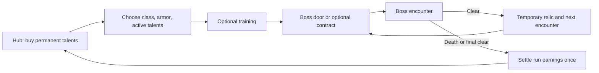

# Boss Fight mechanics and roguelite redesign proposal

This proposal responds to the October 4 mechanics review. Keep the pixel art, food bosses, six classes, armor choices, and co-op, but rebuild the experience around readable combat and permanent class builds purchased after a run ends. The core loop, all 150 talent handlers, optional contracts, and boss pacing revisions are now implemented. This document retains the original proposed direction; consult [implementation and validation](MECHANICS_IMPLEMENTATION.md) for shipped behavior, test limits, and deferred experiments.

The companion [talent review](TALENT_REDESIGN.md) covers every one of the current 150 nodes, including its current description, implementation status, proposed effect, and purchase tier. [Talent proposal data](talent-redesign.json) preserves the existing IDs for implementation and coverage checks. All numerical values below are starting points for playtesting.

## Findings from the current implementation

| Finding | Evidence and consequence |
| --- | --- |
| Training basic attacks ignore the cursor | `updatePlayerFacingTowardAttackTarget()` substitutes the dummy position whenever the player is in the starter room. Abilities use the mouse aim, so attacks and abilities follow different rules. |
| Training attacks deal damage without traveling | `shootAt()` immediately damages the dummy and pre-populates the projectile's `hitTargets`. Distance, aim, and collision do not determine that hit. |
| Starter projectiles disappear after one update | `updatePlayerProjectiles()` has a maze branch but otherwise ultimately checks `world.arena`. Starter projectiles are outside those bounds. Simulation probes for all six classes created a projectile, immediately dealt dummy damage, then removed the projectile after 1/60 second. |
| The dummy bypasses important damage modifiers | `damageBossTarget()` returns through `damageTrainingDummy()` before the ordinary local damage path. Mark multipliers and several talent hooks cannot be evaluated faithfully there. |
| Art and attack origins use different anchors | The new 32 by 48 hero frames place the ground anchor near the feet. Basic projectiles still spawn around `player.x/y`, while the visible weapon is considerably higher. The dummy's sprite placement also uses a different vertical offset. |
| Legacy effects are still active | `drawPlayer()` still calls the older attack windups, slash arcs, and cast effects. Replacing sprites and projectile images did not replace the whole presentation path. |
| Hover styles compete | The loaded legacy stylesheet contains more specific hover and focus selectors than the arcade overrides. Old SVG backgrounds, gradients, and inset highlights can win on the new buttons. This explains inconsistent styling; the user's exact clipping artifact still needs a visual reproduction. |
| 66 talents lack a gameplay hook | There are 25 nodes per class; 11 per class have no reference after the talent definitions. The other 84 have hooks, which does not establish that their descriptions or balance are correct. No generic effect interpreter implements the missing nodes. |
| Some descriptions promise another behavior | Counterquake, Stonefist, Long Mark, Execution Mark, Bullseye Refund, Marked Detonation, Vow Of Return, Aegis Anchor, Haste Verse, and Vanishing Act are examples. Rescue Verse duplicates the implemented Encore Recovery concept; Rewind Ward overlaps Time Loop. |
| Talents currently belong to one run | `beginRun()` resets learned talents and points. Boss clears grant two points during the run. Saved equipment exists, but permanent talent progression does not. |
| Gauntlets share the same encounter skeleton | `createGauntletObstacles()` reuses seven obstacle templates; `createGauntletWave()` reuses two spawn templates, with four then five enemies; every room ends with the same warden structure. Warden attacks vary by theme, but layouts, objectives, and ordinary enemy roles remain largely shared. |

The bosses already contain different mechanics, including Burger charges, Shake refills, Donut stages, Taco ingredients, and Sushi segments. The redesign should make those decisions more readable and rewarding. Repetition in their approach rooms is a separate, well-supported problem.

## The proposed run loop

Death should end a normal roguelite run. The result screen banks progress earned before death and takes the player to the upgrade hub. Clearing the entire game should not be required to obtain an upgrade. Replace the ordinary Retry Encounter action with New Run; retain checkpoint retries in an explicitly labeled Practice mode that awards no permanent currency.

Permanent talent purchases happen only after a run, in the hub. During a run, cleared bosses can still offer a choice of temporary relics, adapting the existing reward cards. These disappear when the run ends. That preserves moment-to-moment build variety while putting permanent advancement where the user requested it. Boss intermissions show progress and the next encounter; they no longer offer Learn or spendable talent points.

For the first prototype, retain the existing boss order and replace only the first two approach rooms. Once the loop works, test shorter six-boss routes drawn from the eleven encounters, with two choices from each difficulty band. This later route experiment should not hold up the training and progression fixes.

### Earnings and permanent purchases

Use one shared permanent currency, provisionally called Marks. A player may invest it in any class so switching classes does not strand all their progress.

- Each distinct boss cleared in a run earns one Mark. Completing an optional contract earns one, once per contract.
- Reaching depth milestones of one, three, six, and eleven bosses earns two bonus Marks each, once per profile. The first boss therefore provides three Marks on a new profile, enough for an immediately useful purchase. Repeated runs at that depth still earn their ordinary clear rewards.
- A final clear adds three Marks. An eleven-boss clear earns fourteen before contracts or new-depth milestones; a later six-boss route earns nine before those bonuses.
- Ordinary enemy kills, damage dealt, time spent, and repeated encounter retries grant no permanent currency. Support players receive the same encounter earnings as their teammates.
- A foundation costs two Marks, a technique four, and a keystone eight. These are fixed one-time unlocks, without rank grinding.
- Bank earned Marks on death, victory, or an explicit End Run action. Show the current earned amount before confirming End Run. A crash or connection loss preserves a resumable run record rather than silently discarding or duplicating earnings.

Purchasing three non-keystone talents in a class opens that class's keystones. Replace the long compulsory node chains with this class milestone; players should not buy effects they do not want just to reach a useful node. Keep the branch organization and stable talent IDs for browsing and save migration.

Target the first meaningful purchase within one or two short attempts: a first boss clear grants three Marks, while completing the first optional contract and then dying still banks one. Two such attempts can buy a foundation even before the first boss clear. Big Cola must remain beatable with every unupgraded class, including solo Bard; permanent upgrades cannot compensate for an unfair opening encounter.

### Meaningful upgrades without an inevitable solved build

Purchases remain unlocked permanently. Before a run, equip four foundation or technique talents and one keystone. A new profile begins with the ordinary full class kit and empty talent slots; no class loses baseline abilities. Unlocked talents may be rearranged freely between runs. The training room previews a proposed build before launch.

This creates permanent progress and recognizable builds without eventually activating all 25 talents simultaneously. Every keystone supplies its own essential trigger. For conditional support talents, the loadout must explain which equipped effect supplies Bleed, Burn, or another prerequisite and reject combinations that literally cannot activate. No purchase chain requires its ancestors to occupy active slots.

Avoid an endless account-wide damage ladder. Ordinary persistent stat bonuses should be small and capped; the main power gains should be class-specific timing, interactions, and new attack behavior. Buying a technique should noticeably change the next run, even if the player has never reached the final boss. Offer free purchase refunds during the initial balance rollout, then retain free build swapping.

### Co-op and save behavior

Each player keeps their own profile and active talent selection. Lock the selections when the run begins and transmit the active IDs through the existing player setup messages. The host remains authoritative for encounters, damage, objective completion, and shared clears.

A defeated player spectates. A party wipe ends the normal run and opens results for everyone; the host's sequenced end-run message replaces the normal-mode retry flow. Practice mode retains the current sequenced retry machinery. Host departure gives an explicit explanation and a single results settlement for confirmed progress, then returns the party to the lobby.

Keep the existing health and potion refill behavior for the first two-boss prototype so the progression experiment is isolated. Then test a run resource model: start with three potions, clear a boss for 25% maximum-HP healing and one potion up to three, and revive defeated teammates at 30% HP after a party clear. These are draft values. Compare them against full refills for run length, healing-build dependence, and whether an optional contract's health risk matters. The normal mode must never provide a free full refill through a retry.

Save a versioned profile with owned talents, currency, milestones, active builds, and a run journal. Settlement uses the run ID and completed encounter IDs and must be idempotent. Retrying a settlement after reconnect or reload must not award the same boss twice. Preserve existing gear and server configuration. Existing transient in-run talents can finish their current legacy run; migrate new runs to the hub system without inventing historical earnings that were never saved.

## Combat and training changes

### Make the training room a faithful combat preview

Fix the training bugs before changing damage or attack speed. Use the same aiming, projectile travel, collision, status, and damage pipeline in training and encounters. The room determines bounds and available targets; it should not grant an automatic hit. Add swept collision where a fast projectile can cross a small target between frames.

Keep a stationary dummy, add a three-dummy cluster and an optional moving target, and let the player toggle a slow incoming-projectile practice pattern. These settings are useful for testing splash, marks, defense, and support effects. Training produces no currency and cannot trigger run milestones.

Display rolling five-second DPS, damage from the last action, active status stacks, and the name of the triggering talent. Add Reset Target and Reset Cooldowns controls. Separate direct damage, damage over time, and proc damage in an optional details view. A miss should remain a miss. Healing and shielding need a visible practice ally or self-damage toggle so Bard and Paladin can inspect their builds too.

### Connect animation, origin, and hit geometry

Add per-frame metadata for feet, hand, weapon tip, and cast origin in every facing direction. Keep the gameplay position continuous; use a shared conversion to attach rendered effects and collisions to the intended action. Recompute aiming from the relevant attack origin to the cursor so changing the origin does not introduce a new accuracy error.

Review the Warrior and Paladin basic attacks as true close-range swings with a visible weapon path. Their current basics are short-lived traveling projectiles. First preserve their existing reach and DPS while fixing presentation; then playtest a sweep hitbox as a separate mechanical change. Rogue should have a readable short stab or dagger release; Ranger, Mage, and Bard need visible releases from bow, staff, and instrument. Ground-targeted fields should display an origin cast cue and a destination marker rather than appear to launch from empty space.

Replace the old presentation functions with small authored pixel sequences: anticipation, release, travel, impact, and recovery. Use crisp stepped contours and limited palettes instead of smooth glowing arcs. Friendly areas use teal tile corners and a support emblem; hostile warnings use patterned boundaries and a danger emblem. Color is one signal, shape another. The warning shape and damaging shape must describe the same area, even if the artwork decorates its edge.

An individual attack should have one effect identity and one hit identity. Cosmetic particles, echoes, and sound events cannot create extra damage. Proc attacks cannot recursively trigger themselves. Co-op peers reconstruct presentation from the same attack ID, origin, direction, and phase, while the host resolves gameplay.

### Tune responsiveness after correctness

Keep held attack and current bindings. Buffer an ability press for roughly 120 milliseconds when the action will become available, without carrying the buffer through menus or transitions. Show a brief cooldown message or flash when it cannot activate. Test reducing Mage's current 300-millisecond movement lock to a short release lock, followed by reduced-speed movement; confirm that this does not erase the class's commitment tradeoff.

Give enemies a visible tell and a committed attack direction before contact or projectile damage. Tune attack anticipation and recovery together. The reward for dodging a committed attack should be an obvious opportunity to hit, not immediate replacement by another unannounced attack. Also test fixed basic damage in place of the current unexplained random damage range, leaving explicitly described critical effects to create variation. Training measurements should not fluctuate simply because an ordinary hit rolled differently.

## Menu interaction cleanup

Retire legacy button hover selectors from the active arcade UI and define one component with separate idle, hover, pressed, selected, disabled, and keyboard-focus states. Use a full rectangular hover border and a modest solid fill. Use gold for persistent selection and teal inset corner marks for keyboard focus. Avoid exterior outlines and tooltip placement that can be cropped by a scrolling parent.

Do not stretch old button SVGs across large portrait cards. Remove transforms and partial inset bars that change the silhouette. Keep the existing persistent details panels for talents and rewards; put requirement explanations there rather than in tiny tooltips above a node. Validate all six states on title buttons, loadout cards, talent nodes, reward cards, settings, lobby controls, and results.

## Replace mandatory gauntlets with optional contracts

Every encounter offers a direct Boss door and, where available, an optional contract room. The direct door is a valid path and does not penalize a build for skipping filler. Contracts risk health and time in exchange for a temporary relic and one bankable Mark. Completing the objective opens the exit; killing every enemy is rarely required. Remove the generic high-health warden unless it is the room's deliberate objective.

Aim for 30 to 60 seconds for an ordinary contract. Start with two or three authored layouts per room family. Randomize useful parameters such as vent timing, delivery route, or enemy role composition, rather than merely jittering the same obstacles. All contracts show their objective, reward, and failure rule before entry. Failed optional objectives should usually open the exit without the reward, not force a prolonged cleanup fight.

| Encounter | Proposed optional room | Decisions and enemies |
| --- | --- | --- |
| Big Cola | Pressure Works | Release three pumps while predictable pressure waves sweep lanes. Fizz workers charge pumps instead of endlessly chasing the player. Interrupting a charge buys a vent window. |
| Big Burger | Assembly Line | Redirect conveyors to move ingredients into a grill. Bun guards protect their front; pickle flankers briefly expose themselves after a dash. Choose fast delivery or detouring for cover. |
| Curly Fries | Fryer Crossing | Cross alternating fryer baskets and open a drain. Salt snipers commit to narrow shots while runners try to block the safe crossing. The exit is an objective, not an enemy count. |
| Condiment Trio | Mixing Station | Rotate three nozzles to fill matching vats. Small attendants react to the current mixture, creating a target-priority problem and teaching the bottles' different roles. |
| Special Sauce | Overflow Cellar | Burst valves to maintain a dry path through rising sauce. Decide whether to grab a reward cache or leave before the next flood. The hazard advances visibly rather than filling arbitrary circles. |
| Peanut Buster Shake | Freezer Outage | Carry a battery between heaters; the active heater creates a safe thawed lane. Charging enemies push toward the battery. Local ice and heat teach movement decisions. |
| Nacho Libre | Cheese Foundry | Disable two armor presses while their quadrants lock and fire. Crusher enemies wind up, commit, then expose a weak back. Players choose which press to shut down first. |
| Pizza Phantom | Oven Delivery | Deliver a hot crate through rotating oven doors. Dropping it briefly creates cover but cools the objective. Braced pepperoni snipers guard lanes; their firing recovery is the crossing window. |
| Donut Donald | Bakery Circuit | Complete an optional stamp route through moving rollers and ring gaps. A short route is safe; an extra stamp grants a better temporary reward. Avoid a mandatory survival marathon. |
| Taco Titan | Market Rush | Secure three ingredient crates while thieves carry them toward exits. Interception and route choices matter more than clearing stationary grunts. The selected seasoning changes the temporary reward. |
| Sushi Serpent | River Crossing | Change current lanes and place bait to expose a river gate. Chopstick guards commit to straight thrusts. Read the current, anticipate a body crossing, and choose an opening. |

Contract completion can change the entrance animation or provide one clearly explained local advantage, but skipping it must leave a fair boss. For the first prototype, keep rewards simple: a temporary relic and a Mark. Do not add eleven separate permanent currencies or complicated objective inventories.

### Enemy roles that produce different responses

Use a small reusable role set with a distinct silhouette and tell: a charger that commits to a lane, a shield guard with a rear opening, a sniper that plants before firing, a worker that operates an objective, and a disruptor that creates one temporary obstacle. Each food theme can reinterpret a role, but the room composition determines how it plays.

Reduce ordinary enemy durability so one deliberate ability resolves a small threat. Cap simultaneous active threats by role, not only total count; avoid several identical snipers firing together. Remove automatic repeated contact damage from mere sprite overlap where an explicit attack animation would be clearer. Scale co-op objective workload and enemy patterns thoughtfully rather than multiplying every enemy's health by party size.

## Give every boss a signature decision and a punish window

These are proposed revisions, not assertions that the current bosses lack these ingredients. A boss should teach one main rule, develop it in a second stage, and finish with a short combination test. Favor a visible major pattern plus at most two minor threats in early encounters. Measure busy overlaps before adding more projectiles.

| Boss | Proposed signature decision | Reward for correct play |
| --- | --- | --- |
| Big Cola | Read the straw aim lock, move into a safe lane, then decide whether to burst a pressure bubble or attack the body. | A vent recovery window with visibly reduced pressure. |
| Big Burger | Bait a committed charge into a grill or ingredient pile, while choosing which ingredient attack to prioritize. | A stagger and an exposed ingredient layer; the boss stops attacking briefly. |
| Curly Fries | Read alternating machine-gun lanes and use the grease-burst recovery to change sides. | A short heat-vent damage window. Avoid continuous fire that simply punishes close-range classes. |
| Condiment Trio | Choose which bottle to disable first; the remaining pair gains one readable combination. | Breaking a bottle interrupts its active pattern. Avoid three independent attacks obscuring one another. |
| Special Sauce | Move between dry regions while choosing which mixture to interrupt. | Interrupting a mixing cycle creates a safe island and an attack window. Differentiate this fight from the Trio's three-target problem. |
| Peanut Buster Shake | Use ice and chocolate lanes to bait a scoop slam, then exploit its recovery. | A break between flavors. Test one health bar with flavor transitions instead of three complete refills; retune total fight length rather than merely cutting HP blindly. |
| Nacho Libre | Commit to a safe quadrant before the cheese wave locks, then move behind the guard. | A rear opening after a crusher or wave. Shorten invulnerable downtime and advertise precisely when it ends. |
| Pizza Phantom | Choose which topping mechanism to interrupt while oven doors change available lanes. | Disabling one topping removes one pattern for a defined cycle, creating a deliberate build-dependent choice. |
| Donut Donald | Read ring gaps and a moving safe pocket. | A generous recovery after the ring closes. Prototype three meaningful stages instead of maintaining six stages with prolonged add or offscreen intervals. |
| Taco Titan | Recover ingredients during a committed slam and choose between objective pressure and direct damage. | A clear guard break. Keep the existing ingredient identity while removing confusing damage immunity and repetitive pickups. |
| Sushi Serpent | Predict the body path and approach an exposed segment from a safe flank. | A segment break interrupts the next sweep and exposes the head briefly. Preserve the serpent movement and multi-target identity. |

Expose the next major action through a distinct pose and brief sound cue. Show invulnerability, armor, and weak-target states directly on the affected part. A phase transition clears stale warnings and gives the player time to recognize the new rule. The full proposal requires playtesting every class against every boss, especially short-range builds and solo Bard.

## Implementation order and acceptance checks

1. **Correct the training room and shared combat origins.** Reproduce the current one-frame projectile removal in a regression test, then fix bounds, collision, damage routing, and directional origins. Verify all six basics and all 24 abilities against stationary, moving, and clustered targets. Test marks, Bleed, Burn, Poison, shielding, and healing there.
2. **Clean hover behavior and replace legacy attack effects.** Remove competing style paths. Inspect hover, focus, selected, and pressed states at 960 by 640, 1280 by 720, 1440 by 900, and 1920 by 1080. Compare the visual warning to actual collision geometry and inspect attacks facing all four directions.
3. **Build a small roguelite prototype.** Add the profile, settlement journal, post-run hub, and active talent slots. Implement Warrior's three foundations and one keystone from each branch first, with Big Cola and Big Burger. Test death after the first boss, buying a talent, and observing its actual effect next run.
4. **Replace two approach rooms.** Prototype Pressure Works and Assembly Line with a direct boss path. Measure how often players choose them, whether the reward justifies the risk, and whether their objectives are clear without explanatory text during combat.
5. **Extend talents in class batches.** Use the companion's complete 150-node mapping. Add effect-level tests for each batch and update descriptions from the same effect data. Do not expose a purchasable node until it has an implementation, correct presentation, and an actual gameplay test.
6. **Revise boss pacing and remaining contracts.** Validate the signature decisions above before adding route selection. Profile particle-heavy builds and four-player battles against the existing 60 FPS target.

Talent tests must compare the actual baseline and upgraded action, not merely confirm that an ID enters a learned set. Cover proc limits, dot tick budgets, cooldown floors, overheal rules, bosses resistant to displacement, and immunity to recursive echoes. Test progression settlement on death, clear, End Run, repeated events, reload, disconnect, and host departure. Check the same active build on host and client, with duplicate and stale messages.

The first playable milestone is deliberately concrete: visible and correctly aimed attacks in training, consistent menu states, a failed run that banks progress, a meaningful permanent purchase, and a visibly different next Warrior run through two distinct encounters. The remaining class and boss changes follow only after this loop is enjoyable.
